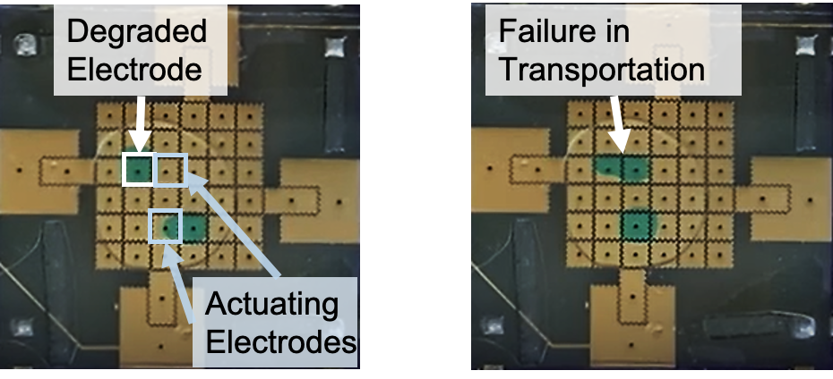
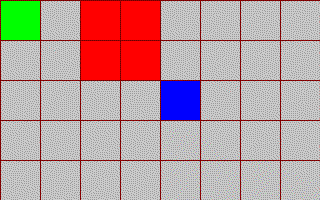

# dmfb-env
An OpenAI Gym-based environment for digital microfluidic biochips (DMFBs).

## Overview
This environment simulates the degradation process of electrodes in DMFBs. An example of a degraded electrode is shown below.


The proposed RL framework can overcome this issue. We recorded how a trained RL agent transports a droplet to the destination with concurrent blocks (in red) in the way. 




For furhter information, please reference our ICML'20 paper named "Adaptive Droplet Routing in Digital Microfluidic Biochips Using Deep Reinforcement Learning".

## Training
First, install all the required libraries when you run dmfb\_env/train.py. Then you can find the training result under the 'log' directory.

## Cite This Work
To cite this work in publications:

```
@inproceedings{liang2020adaptive,
  title = {Adaptive Droplet Routing in Digital Microfluidic Biochips Using Deep Reinforcement Learning},
  author = {Liang, Tung-Che and Zhong, Zhanwei and Bigdeli, Yaas and Ho, Tsung-Yi, and Chakrabarty, Krishnendu and Fair, Richard},
  booktitle={International Conference on Machine Learning (ICML)},
  year={2020}
}
```
